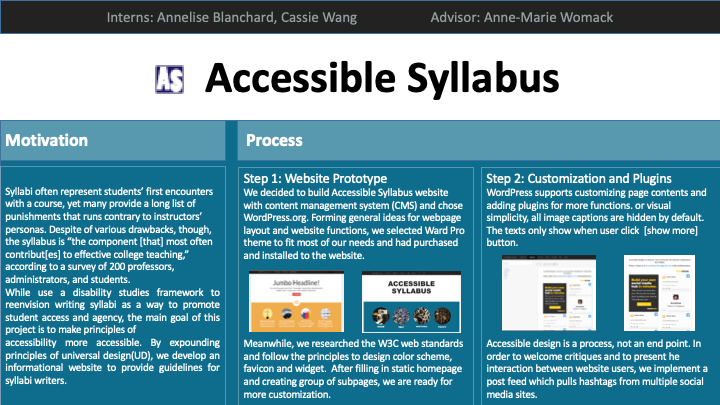
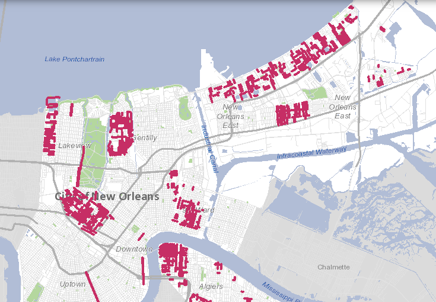

<!-- main -->

<section id="banner" class="style2">
    

        
            
        
        <header class="major">
            <h1>{{ page.title }}</h1>
        </header>
        

            {{ page.description }}
        

    

</section>

	

		<h3>CLIENT</h3>
		
Business Owner, House Buyer, Neighborhood Organization ...

	

	

		<h3>TYPE</h3>
		
Web app, Co-op Internship project

	

	

		<h3>Role</h3>
		
Full Stack Dev

	

<!-- one -->
<section id="one">
	

		<header class="major">
			<h2>Unexpected, yet Fruitful</h2>
		</header>
		

        With the initial intent to just satisfy public service graduate requirement at Tulane, my internship with City of New Orleans turned out a fruitful learning experience beyond expectation. Without preparing for anything truly technical, I walked in Sara’s office at City Hall to discuss my upcoming internship with City of New Orleans Office of Information Technology & Innovation. Serving as a Deputy Chief Information Officer for the City, Sara Estes White (Cohen) shared her ambition on the entire lifespan of technology, from K-12 STEM and computer science advocacy, digital literacy, and fostering civic engagement and innovation, to technology workforce development, implementation and management of enterprise technology systems. While I was surprised about the great enthusiasm on technology for a government institution, I pitched in with my background in computer science and experience on web development.		

		

        The outcome of the meeting was an exciting hands-on project – developing enhancement on user experience for NoticeMe, an early notification tool for land use changes in the City of New Orleans.
		

		
		
		<figcaption><a href="http://noticeme.nola.gov/" target="_blank"><i>Check it out (in production)</i></a></figcaption>
		
	

</section>

<!-- two -->
<section id="two">
	

		<header class="major">
			<h2>Think UX in Map Application</h2>
		</header>
		

        When it comes to a map-based application, things become a little complicated. There is a lot of data generated in everyday usage, via a targeted search, or simply clicking around to explore the area. As a user, I would like to mark Area of Interest and have them available on the view for easy access every time I log in; at the same time, saving a browsing history in certain time span would be helpful in case I forgot to mark important place down. Moreover, I would like to filter entire map based on certain criteria, like under construction or planned construction, to see my potential Area of Interest.
		

		

        To support these enhancements, I need a comprehensive understanding on the architecture, as well as technology used for implementation. With my mentor’s help, I started with my first task – adding the ability to toggle data display.
        

        <section class="spotlights">
        	<section>
        		
        		

        		    

                    In ArcGIS API, a map view is built upon layers. Data points are dropped on a layer, and we can choose to show or hide it. Toggling the data display is just switching between different layers – straight forward enough. Thanks to the updated documentation, it did not take me too much time studying the API to figure out which layers to pick.
        		    

        		

            </section>
            <section>
                
                

                    

                    After having a basic understanding of the layers, time for me to go a level deeper to create one and draw some lines. My second task is to highlight My Areas: In the web app, after a user logs in, we would like to display the user’s areas of interest so they can quickly compare the last week’s data to the areas for which they receive emails. This involves editing the JavaScript that drives the interface, and using ESRI’s ArcGIS JS API to display the areas.
                    

                

            </section>
            <section>
                
                

                    

                    The last task falls entirely on backend, which concludes my full-stack journey of my first map application. Show data points for the last week: this involves editing the backend Python scripts and batch files to save the extracted data each day, and configuring ETL processes to ship the data to an Amazon EC2 instance and load it on the remote end so it can be displayed on the map in NoticeMe.
                    

                

            </section>
        </section>
    

</section>

<!-- three -->
<section id="three">
    

        

        In a semester-long co-op internship, I was so lucky to experience the entire development flow of a sophisticated map application. From learning ArcGIS JS API to configuring ETL process, I came to realize the breadth of knowledge full-stack development requires. Thanks to Sara, JB, and City of New Orlans Office of Information Technology & Innovation for this opportunity – it was invaluable to me at the beginning of tech career.
        

        
            
        
    

</section>

